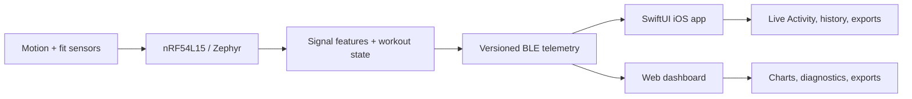

# Kyntex Technical

[](https://github.com/Kyntex-org/Kyntex-Technical-Public/actions/workflows/validate.yml)

Selected, reviewable software from [Kyntex](https://github.com/Kyntex-org/Kyntex)
— a wearable-sensing platform for training telemetry you can trust. The
hardware-independent parts live here so the engineering can be built, tested, and
read without a development board or the nRF Connect SDK.

The full system is an embedded stack on Nordic nRF54L15 (Zephyr RTOS), a custom
versioned BLE protocol, a SwiftUI iOS client, and a Web Bluetooth dashboard —
engineered end to end by a single developer. This repository shows the parts that
stand on their own.



## What to look at first

| If you want to see… | Look at |
| --- | --- |
| Embedded C and signal processing | [`firmware-core/`](firmware-core/) |
| Protocol design and data integrity | telemetry framing module + its tests |
| Frontend and data visualization | [`dashboard/`](dashboard/) (runs with no hardware) |
| Native iOS architecture and UX | [`docs/ios-companion.md`](docs/ios-companion.md) |
| End-to-end design decisions | [`docs/system-architecture.md`](docs/system-architecture.md) |

## Engineering coverage

| Layer | Selected work |
| --- | --- |
| Embedded | Zephyr-based acquisition, timing state machines, rolling motion features, power-aware session control |
| Reliability | Versioned packets, checksums, sequence/drop counters, reconnect behavior, bounded recording storage |
| iOS | SwiftUI, CoreBluetooth, ActivityKit, guided calibration, animated workout feedback, local history/export |
| Web | Dependency-free modules, Canvas charts, Web Bluetooth, IndexedDB, PWA caching, deterministic demo data |
| Verification | Hardware-independent C tests, JavaScript tests, protocol compatibility tests, CI on every push |

## Firmware core

[`firmware-core/`](firmware-core/) contains three C11 modules extracted from the
production firmware and made independently testable:

- **Band session timing** — debounced wear detection that gates a workout on
  confirmed band contact, so sessions are not triggered by picking the device up.
- **Motion features and classification** — rolling RMS feature windows feeding
  explainable movement classification, with orientation-independent handling so a
  changed mounting angle does not read as motion.
- **Telemetry framing** — packet construction, checksums, and packet/sample gap
  tracking that makes dropped data observable instead of silently absent.

The test suite covers timing boundaries, interrupted band contact, sensor
orientation, sample-rate changes, corrupt packets, and missing sequence numbers.
Board pins, BLE UUIDs, hardware drivers, and device calibration values are
deliberately excluded.

Build and run the tests with:

```text
cmake -S firmware-core -B build/firmware
cmake --build build/firmware
ctest --test-dir build/firmware --output-on-failure
```

## Dashboard

[`dashboard/`](dashboard/) is a dependency-free browser application — no
framework, no build step — for viewing motion signals and session summaries. It
includes live Canvas charts, bounded session history, JSON and CSV export, and an
offline application shell. A deterministic signal generator feeds the interface
when no band is connected, so the full interface can be reviewed without
hardware.

To run it locally:

```text
python -m http.server 8000
```

Open `http://localhost:8000/dashboard/`.

## iOS companion app

The private production client is a native SwiftUI application with a
CoreBluetooth transport and an ActivityKit Live Activity. The current flow
includes professional onboarding, guided personal calibration, live movement
feedback through the animated Kynny character, pause/recap views, and session
and lifetime history.

Its Knee Load experience separates accumulated Motion Load from landing Impact
Load and explains that the score is a personalized movement-and-impact proxy,
not a direct measurement of joint force or injury risk. The public
[`iOS case study`](docs/ios-companion.md) documents the architecture and product
decisions without publishing production UUIDs or calibration constants.

## Review in five minutes

1. Read the [system architecture](docs/system-architecture.md).
2. Run the C test suite using the commands above.
3. Start the dashboard and interact with its hardware-free signal generator.
4. Review the [iOS companion case study](docs/ios-companion.md).

## Scope

The signal generator and firmware constants in this repository are intended for
software testing. This code does not connect to a Kyntex band and does not
contain production protocol definitions, hardware wiring, credentials, or user
data.

Hardware design and bring-up notes are maintained in the
[Kyntex project repository](https://github.com/Kyntex-org/Kyntex/tree/main/docs/hardware),
including the
[Altium workspace](https://github.com/Kyntex-org/Kyntex/blob/main/docs/hardware/altium/README.md).

## License

Copyright and usage terms are in [LICENSE](LICENSE).
