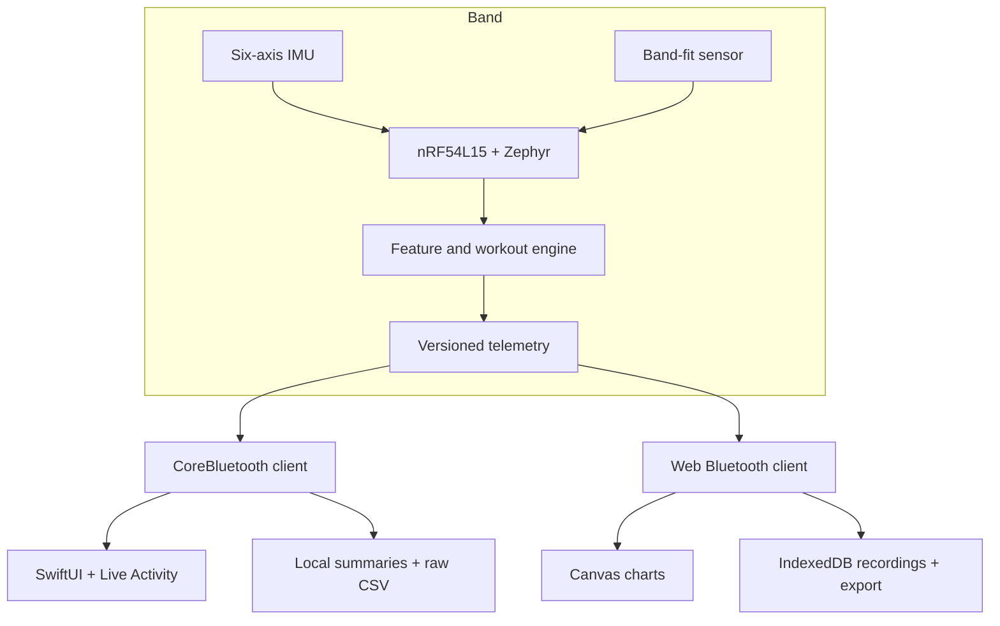

# System architecture

Kyntex is an end-to-end wearable prototype. The production implementation
spans embedded acquisition, signal processing, a versioned Bluetooth transport,
and native and browser companion applications.

## Design priorities

### Observable data quality

Packets carry enough integrity metadata for clients to recognize reconnects,
firmware sessions, missing packets, missing samples, and device-side drops.
The applications report gaps rather than silently presenting an incomplete
recording as complete.

### Stable behavior across sample rates

Motion features use time-based windows and reset deliberately when the sample
rate changes. The public C modules demonstrate this behavior without depending
on a board or vendor SDK.

### Clear session ownership

Band-contact hysteresis prevents brief contact from opening a workout and
prevents momentary loosening from ending one. Companion applications can still
recover a completed summary when a disconnect hides the final state packet.

### Bounded long-session storage

Live charts keep short rolling windows. Raw recordings are streamed to durable
local storage, while only bounded summaries remain in fast application state.
This separates visualization needs from full-resolution export needs.

### Backward-compatible evolution

Telemetry is versioned. Current companion applications retain older packet
decoders while new firmware can add integrity or load-model semantics. Settings
writes remain deliberately conservative so older firmware can still accept
them.

## Personalized load model

The current product uses a short standing-and-walking calibration to establish
a personal motion baseline and the dominant lower-leg rotation axis. During a
session, acceleration and rotation are accumulated with walking/running
context; landing peaks are handled separately so jumps are not counted twice.
Robust limits keep isolated sensor knocks from dominating an entire session.

This is an engineering training metric. A single sensor below the knee cannot
directly measure joint contact force, tissue stress, pain, fatigue, or injury
risk. The product language and information screens make that boundary explicit.

## Public/private boundary

This portfolio includes independently testable logic and a hardware-free
dashboard. Production board configuration, BLE identifiers, calibration
constants, device-control code, credentials, and user data are intentionally
excluded. A deeper private walkthrough is available when appropriate.
